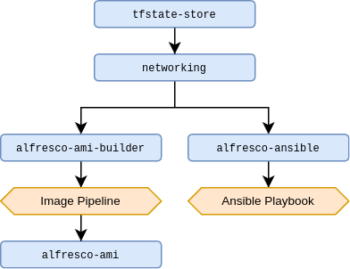

## Apply Order



Note that the `Image Pipeline` step(s) are performed manually at this stage.

## Scripts

Scripts are available for Linux (`src/scripts/bash`) and Windows PowerShell (`src/scripts/powershell`).

### Authenticate

#### Linux setup

Use to authenticate with AWS and create a `terraform` profile with assumed role credentials. Copy `setenv.sh.dist` to
`setenv.sh` and fill in the missing details; the auth script will automatically pick up these values.

#### Usage

```shell
cp setenv.sh.dist setenv.sh
# enter details in setenv.sh
./src/scripts/bash/authenticate.sh
```

```powershell
./src/scripts/powershell/Authenticate.ps1
```

### Deploy

Available for Linux only at present.

Convenience script for executing a deploy in a given project and environment. Can be used to `plan`, `apply`, and
`destroy`.

#### Usage

All args are optional except `--project`.

| Argument            | Description                                                          |
|:--------------------|:---------------------------------------------------------------------|
| --home={path}       | Sets the working directory. Defaults to current working dir (`pwd`). |
| --project={project} | Maps directly to `src/projects/{project}`.                           |
| --environment={env} | Maps directly to `src/projects/project/{env}`.                       |
| --plan              | Sets the mode to `plan`. This is the default mode.                   | 
| --apply             | Sets the mode to `apply`.                                            |
| --destroy           | Sets the mode to `destroy`.                                          |
| --approve           | Automatically approves an `apply` or `destroy` command.              |

```shell
./deploy.sh --project=networking --apply
```

### Run in project

Available for Linux only at present.

Used to run other Terraform commands like `init`.

#### Usage

| Argument            | Description                                                                   |
|:--------------------|:------------------------------------------------------------------------------|
| --home={path}       | Sets the working directory. Defaults to current working dir (`pwd`).          |
| --project={project} | Maps directly to `src/projects/{project}`.                                    |
| --environment={env} | Maps directly to `src/projects/{project}/{env}`.                              |
| --command={command} | The command to execute. Can be any bash command, but `terraform` is intended. | 

```shell
./run-in-project-env.sh --project=networking --environment=au-dev --command='terraform init -upgrade'
```

### Start Session Manager session

Use the correct script according to your platform.

| Script                                          | Linux                | Windows              |
|:------------------------------------------------|:---------------------|:---------------------|
| Start direct connection to instance.            | `tunnel-instance.sh` | `TunnelInstance.ps1` |
| Start port forwarding connection to other host. | `tunnel-db.sh`       | `TunnelDb.ps1`       |
