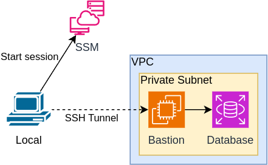
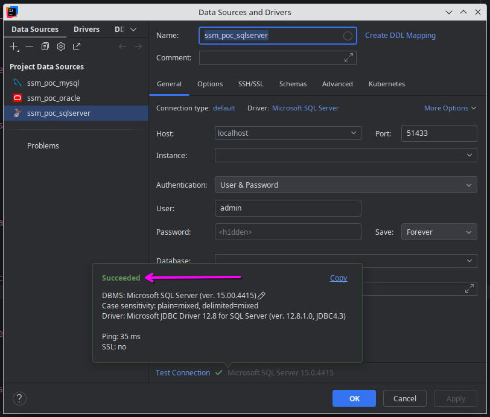

# Connecting to a database with SSM Session Manager

## Bastion server

Unfortunately there is no way to use SSM Session Manager to connect directly to the RDS instance. The solution is to 
connect SM through a bastion host in a private subnet.



## Connecting to the database

The connection is made through an SSH port forwarding session. Rather than using `ssh` directly, you start it with the
`aws ssm start-session` command, as below:

```shell
aws --profile=terraform ssm start-session\
  --region='ap-southeast-2'\
  --target='i-1234567890abcdef'\
  --document-name='AWS-StartPortForwardingSessionToRemoteHost'\
  --parameters='{"host":["instance-name.1234567abcd.ap-southeast-2.rds.amazonaws.com"],"portNumber":["1433"],"localPortNumber":["51433"]}' 
```

Once the output states that it's waitng for connections, you can use your database tool to connect to `localhost:51433`.

The port you connect to is set as `localPortNumber` in the `--parameters` value. It can be any port that isn't already
in use on your machine.

## Example

```
> aws ssm start-session [...]

Starting session with SessionId: terraform-session-xdieffoga2iqyhurfv3rs39ibe
Port 51433 opened for sessionId terraform-session-xdieffoga2iqyhurfv3rs39ibe.
Waiting for connections...
```

Now we can connect to the database.



Once the connection is made from your database tool, you should see this output in the terminal:

```
Connection accepted for session [terraform-session-xdieffoga2iqyhurfv3rs39ibe]
```

### IAM authentication

RDS authentication via IAM users is only supported for MariaDB, MySQL, and PostgreSQL. We cannot use it with SQL Server
or Oracle.

https://docs.aws.amazon.com/AmazonRDS/latest/UserGuide/Concepts.RDS_Fea_Regions_DB-eng.Feature.IamDatabaseAuthentication.html
